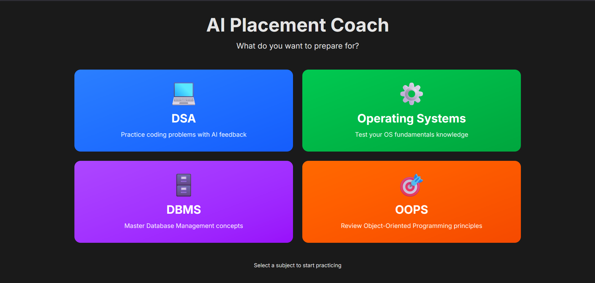
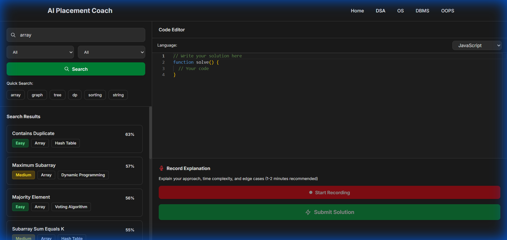
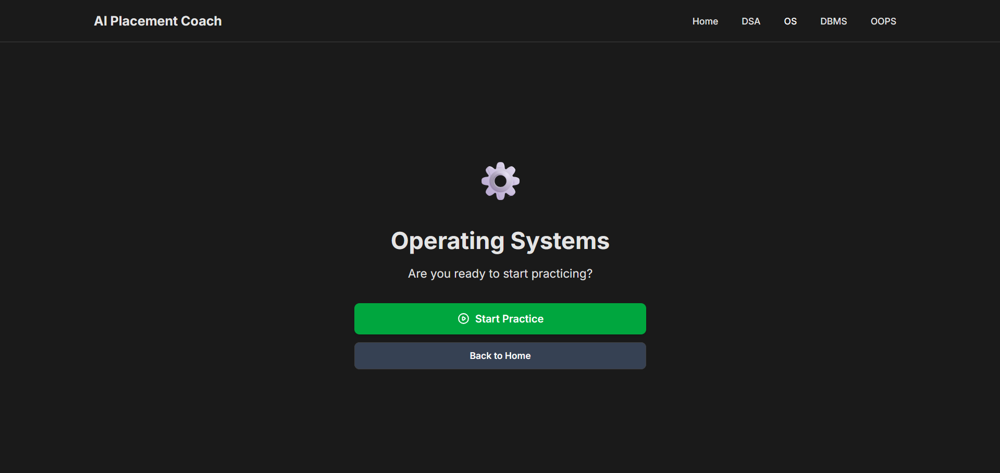
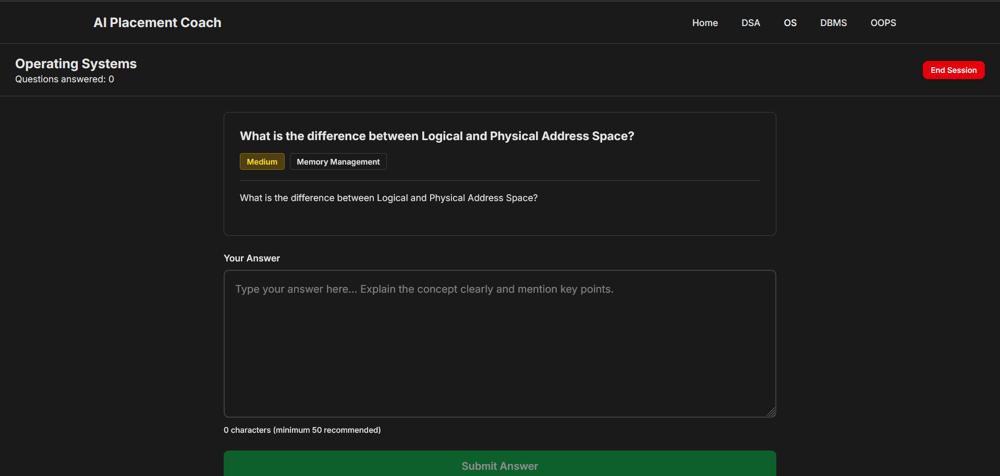
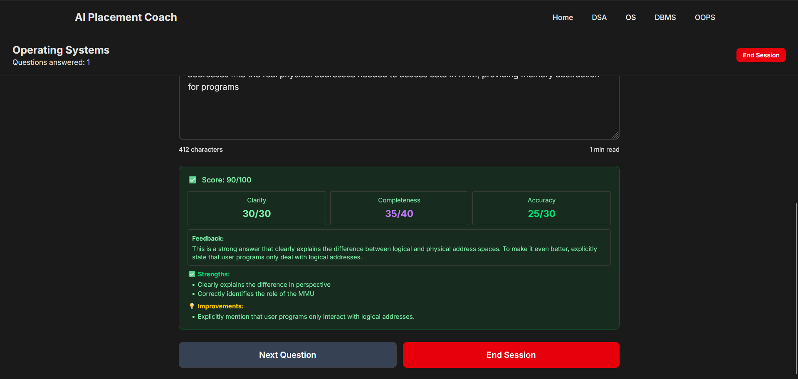
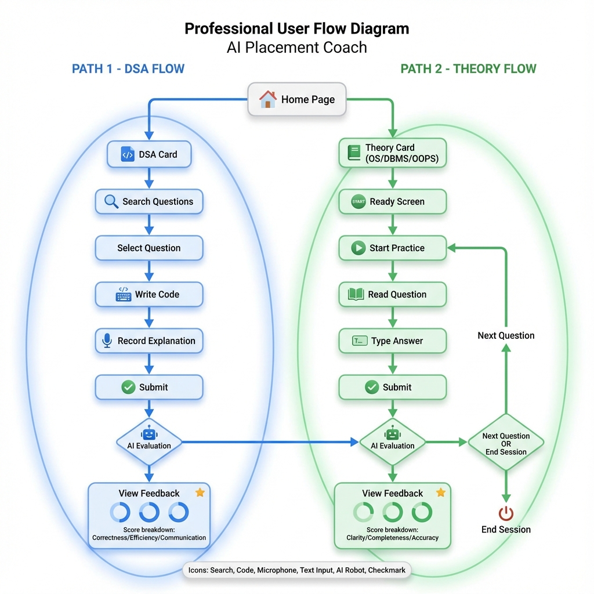

# 🎯 AI Placement Coach

> **Multi-Subject AI-Powered Interview Practice Platform** - Master DSA, OS, DBMS, and OOPS with real-time AI feedback powered by Google Vertex AI

[](https://cloud.google.com/vertex-ai)
[](https://client-delta-wheat.vercel.app)
[](https://nodejs.org)
[](https://react.dev)

---

## 📖 Overview

**AI Placement Coach** is a comprehensive interview preparation platform that helps you ace technical interviews across multiple subjects. Unlike traditional practice platforms that only check if your code runs, we use **Google Vertex AI (Gemini 2.5 Flash)** to provide intelligent, context-aware feedback on both your technical skills and communication ability.

### 🌟 What Makes Us Different?

- **Multi-Subject Coverage**: Practice DSA (coding), OS, DBMS, and OOPS (theory questions)
- **AI-Powered Evaluation**: Real-time feedback using Google Vertex AI Gemini 2.5 Flash
- **Multimodal Assessment**: Evaluate code quality, efficiency, AND explanation clarity
- **Session Management**: Track progress with smart question rotation
- **Production Ready**: Deployed on Google Cloud Run + Vercel

---

## ✨ Features

### 🎓 Four Subject Domains

#### 💻 **Data Structures & Algorithms (DSA)**
- 35+ curated LeetCode-style coding problems
- Professional Monaco code editor (VS Code engine)
- Voice explanation recording
- AI evaluation of code correctness, efficiency, and communication
- Semantic search with vector embeddings

#### ⚙️ **Operating Systems (OS)**
- 50 comprehensive theory questions
- Topics: Process Management, Memory, Scheduling, Deadlocks, File Systems
- Text-based answer evaluation
- Detailed AI feedback on clarity, completeness, and accuracy

#### 🗄️ **Database Management Systems (DBMS)**
- 30 curated database questions
- Topics: ACID, Normalization, Joins, Indexing, Transactions, SQL
- Schema design and query optimization problems
- Conceptual understanding evaluation

#### 🎯 **Object-Oriented Programming (OOPS)**
- 30 OOP concept questions
- Topics: Encapsulation, Inheritance, Polymorphism, Abstraction
- Design pattern questions
- Real-world application scenarios

### 🤖 AI-Powered Features

**For DSA (Coding)**:
- Correctness (0-40 pts): Does the solution solve the problem?
- Efficiency (0-30 pts): Time and space complexity analysis
- Communication (0-30 pts): How well did you explain your approach?

**For Theory (OS/DBMS/OOPS)**:
- Clarity (0-30 pts): Structure and readability of answer
- Completeness (0-40 pts): Coverage of key concepts
- Accuracy (0-30 pts): Technical correctness

### 🎨 Modern UI/UX

- **Clean Navigation**: Intuitive navbar with route highlighting
- **Color-Coded Actions**: Green for actions, Gray for navigation, Red for warnings
- **Loading Indicators**: Smooth route transitions with visual feedback
- **Responsive Design**: Works seamlessly on desktop and mobile
- **Session Tracking**: See progress with question counters

---

## 🏗️ Architecture

### System Overview


### Component Flow

```
┌─────────────────────────────────────────────────┐
│          Frontend (React + Vite)                │
│     Deployed on Vercel                          │
│  • Home Page with 4 subject cards               │
│  • DSA Page (Code Editor + Voice)               │
│  • Theory Pages (OS, DBMS, OOPS)                │
└─────────────────┬───────────────────────────────┘
                  │ HTTP/REST
                  ▼
┌─────────────────────────────────────────────────┐
│       Backend (Node.js + Express)               │
│     Deployed on Google Cloud Run                │
│  • Question Bank Loader                         │
│  • Vector Search Engine                         │
│  • Audio Transcription Service                  │
└─────────────────┬───────────────────────────────┘
                  │
                  ▼
┌─────────────────────────────────────────────────┐
│         Google Cloud Services                   │
│  • Vertex AI (Gemini 2.5 Flash)                 │
│  • Speech-to-Text API                           │
│  • Text Embeddings (text-embedding-004)         │
└─────────────────────────────────────────────────┘
```

---

## 🚀 Quick Start

### Prerequisites

- **Node.js 18+**
- **Google Cloud Account** with Vertex AI enabled
- **Service Account Credentials** with these roles:
  - Vertex AI User
  - Cloud Speech Client
  - Storage Object Viewer

### Local Setup

```bash
# 1. Clone the repository
git clone https://github.com/Shukla070/ai-placement-coach.git
cd ai-placement-coach

# 2. Install dependencies
npm install
cd client && npm install && cd ..

# 3. Set up Google Cloud credentials
mkdir credentials
# Add your service-account.json to credentials/

# 4. Configure environment variables
cp .env.example .env
# Edit .env with your GCP project details

# 5. Generate vector embeddings (DSA questions)
npm run seed

# 6. Start backend (Terminal 1)
npm start

# 7. Start frontend (Terminal 2)
cd client && npm run dev

# 8. Open browser
# http://localhost:5173
```

### Environment Variables

**Backend (`.env`)**:
```env
GOOGLE_CLOUD_PROJECT_ID=your-project-id
GOOGLE_APPLICATION_CREDENTIALS=./credentials/service-account.json
GCP_REGION=us-central1
VERTEX_AI_TEXT_EMBEDDING_MODEL=text-embedding-004
VERTEX_AI_GEMINI_MODEL=gemini-2.5-flash
PORT=3001
```

**Frontend (`client/.env`)**:
```env
VITE_API_URL=http://localhost:3001
```

---

## 📸 Screenshots

### Home Page - Subject Selection
Choose from 4 comprehensive subject areas for interview preparation.



### DSA - Code Editor with Search
Search for coding problems and solve them with our professional code editor.



### Theory Question - Ready Screen
Get ready to practice with a welcoming interface before diving into questions.



### Theory Question Page - OS Example
Practice with real interview questions across OS, DBMS, and OOPS topics.



### AI Evaluation Results
Receive detailed AI feedback with score breakdown and actionable improvements.



---

## 🛠️ Tech Stack

### Frontend
- **React 19** - Modern UI library with concurrent features
- **Vite** - Lightning-fast build tool and dev server
- **TailwindCSS 4** - Utility-first CSS framework
- **Monaco Editor** - VS Code's code editor (for DSA)
- **React Router v6** - Client-side routing
- **Axios** - HTTP client for API requests
- **React Markdown** - Render problem statements

### Backend
- **Node.js + Express** - Server framework
- **Google Vertex AI** - Gemini-2.5-flash for intelligent evaluation
- **Cloud Speech-to-Text** - Audio transcription
- **Text Embeddings API** - Semantic search
- **FFmpeg** - Audio normalization
- **CORS** - Cross-origin resource sharing

### Deployment
- **Google Cloud Run** - Containerized backend hosting
- **Vercel** - Frontend hosting with automatic deployments
- **Docker** - Backend containerization
- **Cloud Build** - Automated CI/CD pipeline

---

## 📊 Question Bank Statistics

| Subject | Questions | Topics Covered | Difficulty Range |
|---------|-----------|----------------|------------------|
| **DSA** | 35 | Arrays, Trees, Graphs, DP, Sorting, Strings | Easy - Hard |
| **OS** | 50 | Processes, Memory, Scheduling, Deadlocks, I/O | Medium - Hard |
| **DBMS** | 30 | ACID, Normalization, Joins, Indexing | Easy - Hard |
| **OOPS** | 30 | Encapsulation, Polymorphism, Design Patterns | Easy - Medium |
| **Total** | **145** | Full interview coverage | - |

---

## 🔗 Live Deployment

- **Production App**: [https://client-delta-wheat.vercel.app](https://client-delta-wheat.vercel.app)
- **Backend API**: [https://ai-placement-coach-*.a.run.app](https://console.cloud.google.com/run)
- **GitHub**: [https://github.com/Shukla070/ai-placement-coach](https://github.com/Shukla070/ai-placement-coach)

---

## 📈 API Documentation

### DSA Endpoints

**Search Questions**
```http
POST /api/search
Content-Type: application/json

{
  "query": "array sorting",
  "filters": {
    "difficulty": "Medium",
    "companies": ["Google"]
  }
}
```

**Get Question by ID**
```http
GET /api/questions/:id
```

**Evaluate DSA Submission**
```http
POST /api/evaluate
Content-Type: multipart/form-data

{
  "questionId": "q123",
  "code": "function solve() { ... }",
  "language": "javascript",
  "audio": <binary>
}
```

### Theory Endpoints

**Get Random Question**
```http
GET /api/questions/random/:subject?exclude=id1,id2
# subject: OS | DBMS | OOPS
```

**Evaluate Theory Answer**
```http
POST /api/evaluate/theory
Content-Type: application/json

{
  "subject": "OS",
  "questionId": "os_01",
  "answer": "Your detailed answer..."
}
```

---

## 🎯 Usage Guide

### User Flow Diagram



### DSA Practice Flow
1. Click **DSA** card from home page
2. Search for a coding problem
3. Select question from results
4. Write solution in code editor
5. Record audio explanation (optional)
6. Submit for AI evaluation
7. Review detailed feedback

### Theory Practice Flow (OS/DBMS/OOPS)
1. Click **OS**, **DBMS**, or **OOPS** card
2. See "Ready to Practice?" screen
3. Click **Start Practice** (green button)
4. Read question carefully
5. Type answer (minimum 50 characters)
6. Click **Submit Answer** (green button)
7. Review AI evaluation with score breakdown
8. Choose **Next Question** (gray) or **End Session** (red)

---

## 🚢 Deployment Guide

### Deploy Backend to Google Cloud Run

```bash
# Build and deploy using Cloud Build
gcloud builds submit --config cloudbuild.yaml

# Or deploy manually
docker build -t gcr.io/YOUR_PROJECT/ai-placement-coach .
docker push gcr.io/YOUR_PROJECT/ai-placement-coach
gcloud run deploy ai-placement-coach \
  --image gcr.io/YOUR_PROJECT/ai-placement-coach \
  --region us-central1 \
  --allow-unauthenticated
```

### Deploy Frontend to Vercel

```bash
# Using Vercel CLI
cd client
vercel --prod

# Or connect GitHub repo in Vercel Dashboard
# Auto-deploys on every push to main
```

---

## 🧪 Testing

### Run Local Tests
```bash
# Backend tests
npm test

# Frontend tests
cd client && npm test
```

### Test Production Deployment
```bash
# Health check
curl https://your-backend-url.run.app/health

# Test OS question API
curl https://your-backend-url.run.app/api/questions/random/OS

# Test DBMS question API
curl https://your-backend-url.run.app/api/questions/random/DBMS
```

---

## 📖 Project Structure

```
ai-placement-coach/
├── client/                    # Frontend React app
│   ├── src/
│   │   ├── components/       # Reusable UI components
│   │   ├── pages/            # Route pages
│   │   ├── services/         # API client
│   │   └── App.jsx           # Main router
│   └── package.json
├── server/                    # Backend Node.js app
│   ├── routes/               # API route handlers
│   ├── services/             # Business logic
│   │   ├── judge.js          # DSA AI evaluator
│   │   ├── theoryJudge.js    # Theory AI evaluator
│   │   ├── questionLoader.js # Question bank loader
│   │   └── search.js         # Vector search
│   └── index.js              # Express server
├── data/                      # Question banks
│   ├── OS_questionbank.json
│   ├── DBMS_questionbank.json
│   ├── OOPS_questionbank.json
│   └── questions_with_vectors.json
├── Dockerfile                 # Backend container
├── cloudbuild.yaml           # GCP deployment config
└── package.json              # Root dependencies
```

---

## 🤝 Contributing

We welcome contributions! Here's how you can help:

1. **Add Questions**: Expand question banks for any subject
2. **Improve AI Prompts**: Enhance evaluation accuracy
3. **UI/UX**: Design improvements and new features
4. **Bug Fixes**: Report and fix issues
5. **Documentation**: Improve guides and examples


## 🙏 Acknowledgments

Built with ❤️ using:
- **Google Cloud Platform** (Vertex AI, Cloud Run, Speech-to-Text)
- **React** ecosystem and community
- **Monaco Editor** by Microsoft
- **Tailwind CSS** for styling
- **Vercel** for frontend hosting

Special thanks to the open-source community and **Google Cloud** for making advanced AI accessible to developers.

---

## 🎓 Use Cases

- **Students**: Practice for campus placements and internships
- **Job Seekers**: Prepare for technical interviews at top companies
- **Bootcamps**: Structured interview preparation curriculum
- **Universities**: Supplement computer science education
- **Self-Learners**: Build confidence with unlimited practice

---


<div align="center">

**⭐ Star this repo if it helped you prepare for interviews!**

Made with 🚀 by [Shukla070](https://github.com/Shukla070)

</div>
