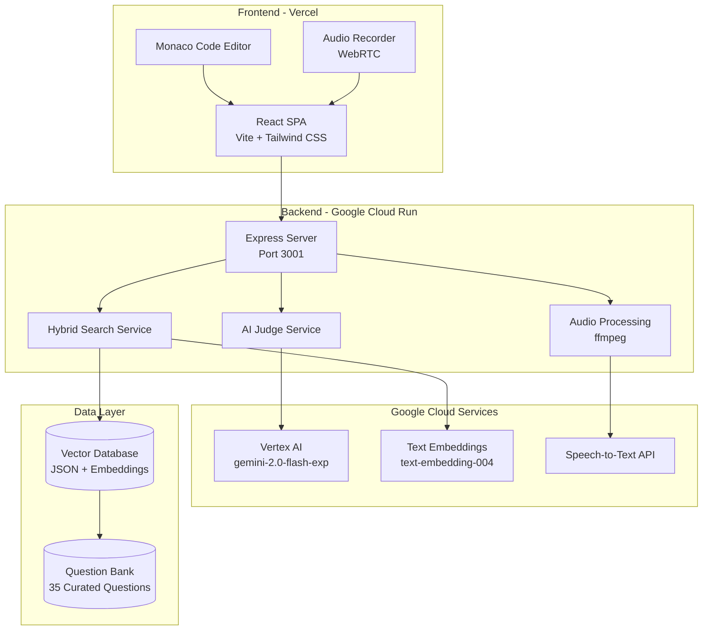
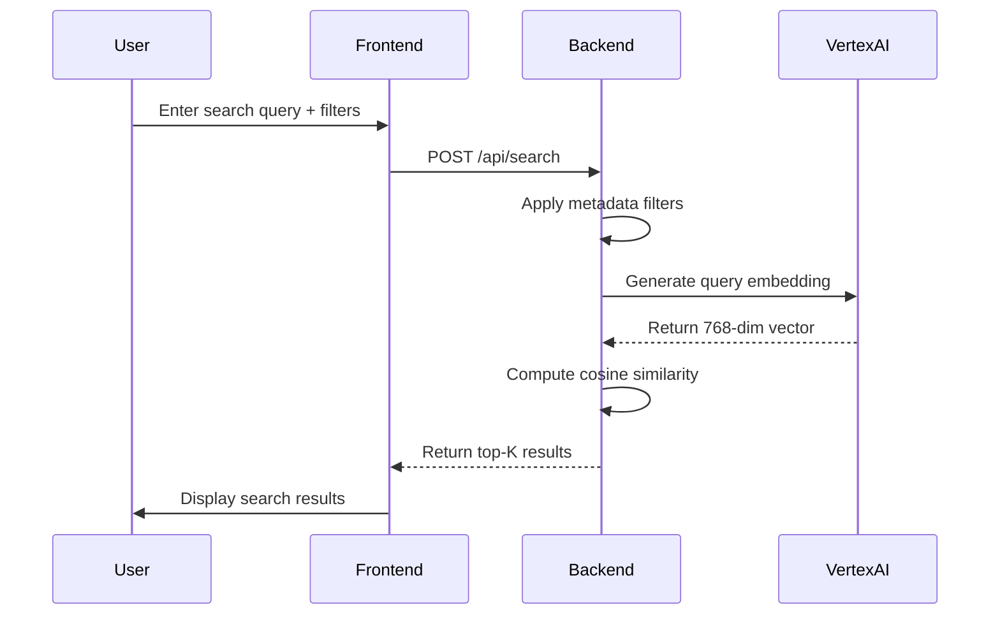
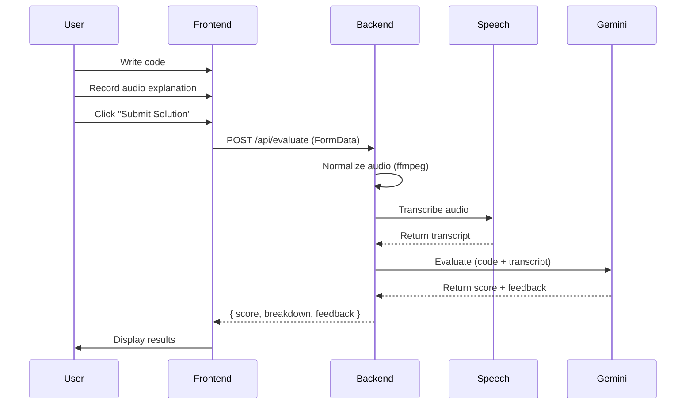

# AI Placement Coach - Architecture Overview

> **Project Type**: Full-stack AI-powered coding interview practice platform  
> **Tech Stack**: React + Express + Vertex AI + Google Cloud  
> **Deployment**: Vercel (Frontend) + Google Cloud Run (Backend)

---

## 🏗️ High-Level Architecture



---

## 📁 Project Structure

```
ai-placement-coach/
├── client/                          # Frontend (React + Vite)
│   ├── src/
│   │   ├── App.jsx                 # Main app with split-panel UI
│   │   ├── components/
│   │   │   ├── CodeEditor.jsx      # Monaco code editor wrapper
│   │   │   ├── QuestionDisplay.jsx # Markdown question renderer
│   │   │   ├── AudioRecorder.jsx   # Audio recording component
│   │   │   ├── SearchBar.jsx       # Search with filters
│   │   │   ├── layout/             # Header, MainLayout
│   │   │   └── ui/                 # Button, Badge, Feedback, etc.
│   │   └── services/
│   │       └── api.js              # API client (axios)
│   ├── vite.config.js              # Dev proxy: /api → localhost:3001
│   └── vercel.json                 # Vercel deployment config
│
├── server/                          # Backend (Express + Vertex AI)
│   ├── index.js                    # Main Express server
│   ├── routes/
│   │   └── evaluate.js             # POST /api/evaluate (multipart)
│   └── services/
│       ├── search.js               # Hybrid search (filters + vectors)
│       ├── judge.js                # AI evaluation with Gemini
│       └── audio.js                # Audio normalization + transcription
│
├── data/
│   ├── question_master_curated.json    # 35 questions with judge context
│   └── questions_with_vectors.json     # Questions + embeddings
│
├── Dockerfile                      # Multi-stage build with ffmpeg
├── cloudbuild.yaml                 # Google Cloud Build CI/CD
└── .env                            # Environment variables
```

---

## 🎨 Frontend Architecture

### **Technology Stack**
- **Framework**: React 19 (latest)
- **Build Tool**: Vite 7.2.4
- **Styling**: Tailwind CSS 4.1.18
- **Code Editor**: Monaco Editor 4.7.0
- **HTTP Client**: Axios 1.13.2
- **Markdown**: react-markdown 10.1.0

### **Component Hierarchy**

```
App.jsx (Main Container)
├── MainLayout
│   └── Header
│       └── Stats display (search results, score)
│
├── LEFT PANEL (35% width)
│   ├── SearchBar (with filters)
│   ├── Search Results List
│   │   └── Question Cards (with badges)
│   └── QuestionDisplay (when selected)
│
└── RIGHT PANEL (65% width)
    ├── CodeEditor (Monaco)
    ├── AudioRecorder
    ├── Feedback Component
    └── Submit Button
```

### **State Management**
- **No external state library** - uses React `useState` hooks
- **Key State Variables**:
  - `currentQuestion` - Selected question object
  - `code` - User's code input
  - `audioBlob` - Recorded audio blob
  - `searchResults` - Array of search results
  - `feedback` - UI feedback messages
  - `submissionScore` - AI evaluation score

### **API Integration**

**File**: [client/src/services/api.js](file:///c:/D/ai-placement-coach/client/src/services/api.js)

```javascript
// Base URL configured via environment variable
const API_BASE_URL = import.meta.env.VITE_API_URL || 'http://localhost:3001';

// Key Functions:
- searchQuestions(query, filters, topK)  // POST /api/search
- getQuestionById(questionId)            // GET /api/questions/:id
- submitSolution(questionId, code, blob) // POST /api/evaluate (FormData)
```

### **Development vs Production**

| Environment | Frontend URL | Backend URL | Proxy |
|-------------|-------------|-------------|-------|
| **Development** | localhost:5173 | localhost:3001 | Vite proxy (`/api` → 3001) |
| **Production** | vercel.app | Cloud Run URL | `VITE_API_URL` env var |

---

## ⚙️ Backend Architecture

### **Technology Stack**
- **Runtime**: Node.js 18+
- **Framework**: Express 4.22.1
- **AI/ML**: Vertex AI SDK 1.10.0
- **Audio**: fluent-ffmpeg 2.1.3 + Google Speech-to-Text
- **File Upload**: Multer 2.0.2

### **API Endpoints**

**File**: [server/index.js](file:///c:/D/ai-placement-coach/server/index.js)

| Method | Endpoint | Description | Request Body | Response |
|--------|----------|-------------|--------------|----------|
| GET | `/health` | Health check | - | `{ status, timestamp, questionsLoaded }` |
| GET | `/api/questions` | List all questions | - | `{ success, count, questions[] }` |
| GET | `/api/questions/:id` | Get single question | - | `{ success, question }` |
| POST | `/api/search` | Hybrid search | `{ query, filters?, topK? }` | `{ success, results[], metadata }` |
| POST | `/api/evaluate` | Evaluate submission | FormData: `questionId, code, audio` | `{ success, score, breakdown, feedback }` |

### **Service Layer**

#### **1. Search Service** ([server/services/search.js](file:///c:/D/ai-placement-coach/server/services/search.js))

**Hybrid Search Algorithm**:
1. **Filter candidates** by difficulty, topics, companies, frequency
2. **Generate query embedding** via Vertex AI `text-embedding-004`
3. **Compute cosine similarity** between query and all candidate embeddings
4. **Sort by similarity** and return top-K results

```javascript
// Key functions:
- hybridSearch(vectorDB, query, filters, topK)
- generateQueryEmbedding(queryText)  // Uses Vertex AI REST API
- cosineSimilarity(vecA, vecB)
- sanitizeQuestion(question)  // Removes judge_context before sending to client
```

**Security**: Sensitive `judge_context` (optimal solutions) is stripped before returning to client.

#### **2. Judge Service** ([server/services/judge.js](file:///c:/D/ai-placement-coach/server/services/judge.js))

**AI Evaluation with Vertex AI Gemini**:
- **Model**: `gemini-2.0-flash-exp`
- **Temperature**: 0.3 (deterministic)
- **Scoring Rubric**:
  - Correctness (0-40 points)
  - Efficiency (0-30 points)
  - Communication (0-30 points)

```javascript
// Prompt structure:
<question>{search_text}</question>
<gold_standard>{optimal_solution, time/space complexity, key_insights}</gold_standard>
<user_code>{userCode}</user_code>
<transcript>{audioTranscript}</transcript>

// Response: JSON with score, breakdown, feedback, strengths, improvements
```

#### **3. Audio Service** ([server/services/audio.js](file:///c:/D/ai-placement-coach/server/services/audio.js))

**Audio Processing Pipeline**:
1. **Normalize audio** with ffmpeg (convert to WAV, resample to 16kHz)
2. **Transcribe** using Google Cloud Speech-to-Text API
3. **Cleanup** temporary files

```javascript
- normalizeAudio(inputPath, outputPath)  // ffmpeg conversion
- transcribeAudio(audioPath)             // Google Speech API
- cleanupTempFiles(...paths)             // Delete temp files
```

### **Data Model**

**Vector Database** loaded into memory on startup:

```javascript
// Structure of each question object:
{
  id: "string",
  title: "string",
  display_markdown: "string",  // Markdown for UI
  search_text: "string",       // Text for vector embedding
  metadata: {
    difficulty: "Easy" | "Medium" | "Hard",
    topics: ["Array", "Hash Table", ...],
    companies: ["Google", "Meta", ...],
    frequency_rating: 1-10
  },
  embedding: [768 float values],  // text-embedding-004
  judge_context: {               // Server-side only
    optimal_solution_code: "string",
    time_complexity: "string",
    space_complexity: "string",
    key_insights: ["string"],
    edge_cases: ["string"]
  }
}
```

---

## 🚀 Deployment Architecture

### **Frontend Deployment (Vercel)**

**Configuration**: [client/vercel.json](file:///c:/D/ai-placement-coach/client/vercel.json)

```json
{
  "buildCommand": "npm run build",
  "outputDirectory": "dist",
  "framework": "vite",
  "rewrites": [{ "source": "/(.*)", "destination": "/index.html" }]
}
```

**Environment Variables**:
- `VITE_API_URL` - Backend URL (e.g., `https://ai-placement-coach-xxx.run.app`)

**Build Process**:
1. Vercel runs `npm install`
2. Builds with `vite build` → generates `dist/` folder
3. Serves static files with SPA routing

### **Backend Deployment (Google Cloud Run)**

**Dockerfile**: [Dockerfile](file:///c:/D/ai-placement-coach/Dockerfile)

**Multi-stage build**:
```dockerfile
# Stage 1: Install production dependencies
FROM node:18-alpine AS deps
RUN npm install --production

# Stage 2: Production image
FROM node:18-alpine AS runner
RUN apk add --no-cache ffmpeg  # For audio processing
COPY --from=deps /app/node_modules ./node_modules
COPY server ./server
COPY data ./data
USER expressuser  # Non-root for security
CMD ["node", "server/index.js"]
```

**Cloud Build CI/CD**: [cloudbuild.yaml](file:///c:/D/ai-placement-coach/cloudbuild.yaml)

```yaml
steps:
  - Build Docker image
  - Push to Container Registry (gcr.io)
  - Deploy to Cloud Run (us-central1, allow unauthenticated)
```

**Environment Variables** (set on Cloud Run):
- `NODE_ENV=production`
- `GOOGLE_CLOUD_PROJECT_ID=$PROJECT_ID`
- `GOOGLE_APPLICATION_CREDENTIALS` - Injected via service account

**Cloud Run Configuration**:
- Region: `us-central1`
- Authentication: `--allow-unauthenticated`
- Container Port: `3001`
- Health check: `GET /health`

---

## 🔐 Security & Best Practices

### **Backend Security**
1. **Sanitization**: `judge_context` stripped from client responses
2. **File Upload Limits**: 10MB max for audio files
3. **MIME Type Validation**: Only accepts `audio/webm|mp4|ogg|wav`
4. **Non-root Container**: Runs as `expressuser` (UID 1001)
5. **CORS**: Configured for cross-origin requests

### **Frontend Security**
1. **Environment Variables**: API URL via `VITE_API_URL`
2. **Error Handling**: User-friendly error messages (no stack traces)
3. **Input Validation**: Code and audio presence checked before submit

---

## 🔄 Key User Flows

### **1. Search Flow**



### **2. Submit & Evaluate Flow**



---

## 📊 Data Pipeline

### **Question Preparation** (Offline)

```
1. Manual curation (question_master_curated.json)
   ↓
2. Run embedding script (scripts/seed.js)
   ↓
3. Generate embeddings via Vertex AI
   ↓
4. Save to questions_with_vectors.json
   ↓
5. Load into backend on startup
```

**Embedding Model**: `text-embedding-004` (768 dimensions)

**Search Text Format**:
```
Title: {title}
Description: {description}
Topics: {topics}
Difficulty: {difficulty}
Examples: {example inputs/outputs}
Constraints: {constraints}
```

---

## 🧪 Development Workflow

### **Local Development**

**Terminal 1 - Backend**:
```bash
cd c:\D\ai-placement-coach
npm run dev  # Starts server on localhost:3001
```

**Terminal 2 - Frontend**:
```bash
cd c:\D\ai-placement-coach\client
npm run dev  # Starts Vite on localhost:5173
```

**Proxy Configuration**: Vite proxies `/api/*` requests to `localhost:3001`

### **Production Deployment**

**Backend** (automatic via Cloud Build):
```bash
git push origin main  # Triggers cloudbuild.yaml
```

**Frontend**:
```bash
cd client
vercel --prod  # Or via Vercel GitHub integration
```

---

## 🎯 Key Technical Decisions

| Decision | Rationale |
|----------|-----------|
| **Vertex AI over OpenAI** | Google Cloud integration, service account auth, better for enterprise |
| **In-memory vector DB** | 35 questions = ~5MB in memory, faster than external DB |
| **Hybrid search** | Metadata filters + vector similarity = more relevant results |
| **Monaco Editor** | Industry-standard, syntax highlighting, IntelliSense-like features |
| **FormData for audio** | Standard for file uploads, works with Express + Multer |
| **Cloud Run over GKE** | Serverless, auto-scaling, simpler ops for stateless backend |
| **Tailwind CSS** | Rapid UI development with modern design system |

---

## 🔮 Current Limitations

1. **No Database**: Questions stored in JSON files (ok for 35 questions)
2. **No Authentication**: Public access (suitable for MVP/demo)
3. **No Code Execution**: AI judges code quality, doesn't run tests
4. **Single Language**: JavaScript only (could extend to Python, Java, etc.)
5. **Audio Storage**: Temporary files deleted after processing (no history)

---

## 📚 Environment Variables Reference

### **Backend ([.env](file:///c:/D/ai-placement-coach/.env))**
```bash
# Required for Vertex AI
GOOGLE_CLOUD_PROJECT_ID=your-project-id
GOOGLE_APPLICATION_CREDENTIALS=./credentials/google-cloud-key.json
GOOGLE_CLOUD_LOCATION=us-central1  # Optional, defaults to us-central1

# Server config
PORT=3001
NODE_ENV=development
VECTOR_DB_PATH=./data/questions_with_vectors.json
```

### **Frontend (Vercel Environment)**
```bash
VITE_API_URL=https://ai-placement-coach-xxx.a.run.app
```

---

## 🎓 Learning Resources

**Key Files to Understand**:
1. [client/src/App.jsx](file:///c:/D/ai-placement-coach/client/src/App.jsx#L1-L318) - Frontend logic
2. [server/index.js](file:///c:/D/ai-placement-coach/server/index.js#L1-L217) - API routes
3. [server/services/search.js](file:///c:/D/ai-placement-coach/server/services/search.js#L1-L220) - Search algorithm
4. [server/services/judge.js](file:///c:/D/ai-placement-coach/server/services/judge.js#L1-L141) - AI evaluation

**External Documentation**:
- [Vertex AI Node.js SDK](https://cloud.google.com/vertex-ai/docs/nodejs/overview)
- [Vite Proxy Configuration](https://vitejs.dev/config/server-options.html#server-proxy)
- [Cloud Run Deployment](https://cloud.google.com/run/docs/deploying)

---

**Last Updated**: 2025-12-30  
**Status**: ✅ Fully deployed and functional
